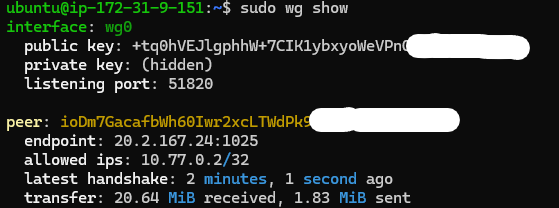
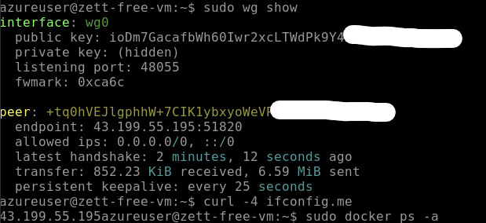
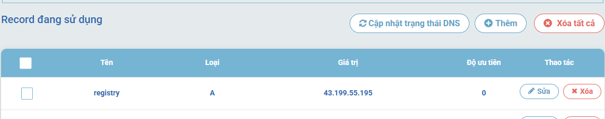
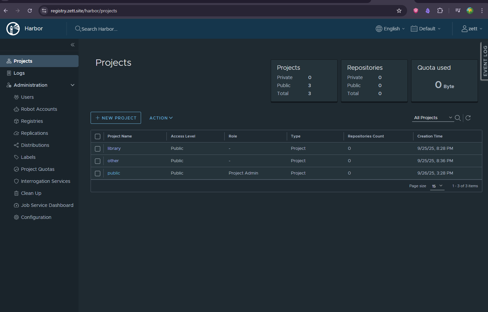

# DevOps Networking: Harbor Registry qua Tunnel AWS–Azure

## 🎯 Mục tiêu dự án
- Triển khai **Harbor Container Registry** trong Azure VM **không có IPv4 public**.
- Sử dụng **AWS EC2** như một **jump host + reverse proxy**:
  - Proxy traffic HTTPS từ internet vào Harbor trên Azure.
  - Làm NAT để Azure có outbound internet (apt update, docker pull).
- Thực hành kỹ năng DevOps/Cloud Networking:
  - WireGuard VPN site-to-site.
  - Routing & NAT với iptables.
  - Nginx reverse proxy với SSL từ Let’s Encrypt.
  - Debug các lỗi DNS/MTU/timeout.

---

## 🏗️ Kiến trúc hệ thống

### Mô tả
- **Azure VM**
  - Chạy Harbor Registry (Docker).
  - Không gắn IPv4 public, chỉ có private IP trong VNet.
  - Kết nối ra ngoài qua WireGuard tunnel → EC2.

- **AWS EC2**
  - Có IPv4 public.
  - Chạy WireGuard.
  - Chạy Nginx reverse proxy:
    - Domain: `registry.zett.site`.
    - Upstream: `10.77.0.2:8080` (Harbor trên Azure).
  - Làm NAT cho traffic outbound của Azure.

### Sơ đồ kiến trúc

```
                   Internet
                       │
                       ▼
         +-----------------------------+
         |       AWS EC2 (Public IP)   |
         |-----------------------------|
         | - Nginx reverse proxy       |
         | - WireGuard (10.77.0.1)     |
         | - NAT outbound              |
         +-----------------------------+
                       │
            WireGuard tunnel (UDP 51820)
                       │
         +-----------------------------+
         |     Azure VM (Private IP)   |
         |-----------------------------|
         | - Harbor Registry (10.77.0.2)|
         | - No public IPv4            |
         +-----------------------------+
```

---

## 🔧 Các bước triển khai

### 1. Chuẩn bị hạ tầng
- EC2: Ubuntu 22.04, gắn IPv4 public, mở port UDP/51820 trong Security Group.
- Azure VM: Ubuntu 22.04, chỉ private IP, firewall mở port nội bộ cho Docker/Harbor.

---

### 2. Cài WireGuard trên cả 2 VM
```bash
sudo apt update
sudo apt install -y wireguard
```

---

### 3. Cấu hình WireGuard

**Subnet ảo:** `10.77.0.0/24`

#### Trên EC2 (`/etc/wireguard/wg0.conf`)
```ini
[Interface]
PrivateKey = <EC2_PRIVATE_KEY>
Address    = 10.77.0.1/24
ListenPort = 51820
MTU = 1420

[Peer]
PublicKey  = <AZURE_PUBLIC_KEY>
AllowedIPs = 10.77.0.2/32
```

#### Trên Azure (`/etc/wireguard/wg0.conf`)
```ini
[Interface]
PrivateKey = <AZURE_PRIVATE_KEY>
Address    = 10.77.0.2/24
DNS = 1.1.1.1
MTU = 1420

[Peer]
PublicKey  = <EC2_PUBLIC_KEY>
Endpoint   = <EC2_PUBLIC_IP>:51820
AllowedIPs = 0.0.0.0/0, ::/0   # Full-tunnel
PersistentKeepalive = 25
```

Khởi động:
```bash
sudo systemctl enable wg-quick@wg0
sudo systemctl start wg-quick@wg0
```

---

### 4. NAT & Forward trên EC2
```bash
# Bật IP forward
echo 'net.ipv4.ip_forward=1' | sudo tee /etc/sysctl.d/99-forward.conf
sudo sysctl --system

# Tìm interface public
ip route get 1.1.1.1

# Cấu hình NAT
sudo iptables -t nat -A POSTROUTING -s 10.77.0.0/24 -o eth0 -j MASQUERADE
sudo iptables -A FORWARD -i wg0 -o eth0 -j ACCEPT
sudo iptables -A FORWARD -i eth0 -o wg0 -m state --state ESTABLISHED,RELATED -j ACCEPT

# Fix MTU
sudo iptables -t mangle -A FORWARD -p tcp --tcp-flags SYN,RST SYN -j TCPMSS --clamp-mss-to-pmtu
```

**Lưu ý:** Disable **Source/Destination Check** cho EC2 trong AWS console.

---

### 5. Cài Harbor trên Azure
```bash
wget https://github.com/goharbor/harbor/releases/download/v2.10.0/harbor-online-installer-v2.10.0.tgz
tar xzvf harbor-online-installer-v2.10.0.tgz
cd harbor
cp harbor.yml.tmpl harbor.yml

# Chỉnh hostname:
hostname: registry.zett.site

./install.sh --with-trivy
```

---

### 6. Cấu hình Nginx reverse proxy trên EC2
```nginx
server {
    server_name registry.zett.site;

    location / {
        proxy_pass http://10.77.0.2:8080;
        proxy_set_header Host $host;
        proxy_set_header X-Real-IP $remote_addr;
    }

    listen 443 ssl;
    ssl_certificate /etc/letsencrypt/live/registry.zett.site/fullchain.pem;
    ssl_certificate_key /etc/letsencrypt/live/registry.zett.site/privkey.pem;
}
```

SSL với certbot:
```bash
sudo certbot --nginx -d registry.zett.site --email you@zett.site --agree-tos --redirect
```

---

### 7. Kiểm thử hệ thống
- **Tunnel handshake**:
  ```bash
  sudo wg show
  ```
- **Outbound từ Azure qua EC2**:
  ```bash
  curl -4 ifconfig.me  
  ```
- **Truy cập Harbor API**:
  ```bash
  curl -vk https://registry.zett.site/v2/  
  ```
- **Docker login và push**:
  ```bash
  docker login registry.zett.site
  docker push registry.zett.site/test/app:1.0
  ```


## 📚 Kỹ năng học được
- Thiết lập **VPN tunnel** cross-cloud (AWS ↔ Azure).
- **Routing-only vs Routing+NAT**: khi nào cần NAT, khi nào không.
- **Nginx reverse proxy** với SSL chuẩn sản xuất.
- **Harbor registry** trong môi trường không public IP.
- Debug:
  - MTU mismatch (502/504 Gateway Timeout).
  - DNS leak khi dùng default outbound Azure.
  - Lỗi SSL (bad key share).
  - Certbot không tìm thấy server block.

---

## 📸 Ảnh minh họa 

1. Handshake `wg show`  
EC2:  
  
Azure VM:   


2. Web harbor registry



3. 
---

